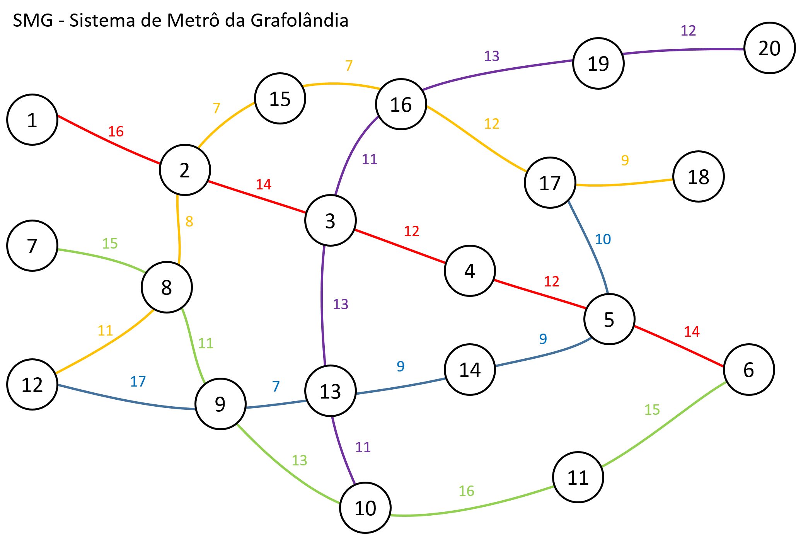

# dijkstra

Trabalho apresentado como requisito parcial à conclusão na matéria TE208 – Técnicas de Programação em Engenharia Elétrica II, do segundo semestre do curso de Engenharia Elétrica, Setor de Tecnologia, da Universidade Federal do Paraná.

Programa para encontrar melhor caminho utilizando algoritimo de Dijkstra no grafo abaixo representando um sistema de metro.

